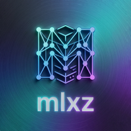

# mlxz

**Run open AI models privately on your Mac.**

mlxz is a native macOS app that downloads open AI models (Qwen, Gemma, and more) and runs
them entirely on your machine — no cloud, no account, no data leaving your Mac. Chat with
models directly in the app, or connect other apps (like VS Code's Copilot Chat) to your
local models through a standard API.

## Why mlxz?

- **Private.** Prompts, chats, and documents never leave your Mac.
- **Free to run.** No subscriptions or API fees — just your Mac's own hardware.
- **Fast.** Built on Apple's MLX framework for Apple Silicon, with speculative decoding
  that speeds up supported models automatically (look for the ⚡ badge).
- **Works with your tools.** Any app that talks to OpenAI-style APIs can talk to mlxz
  instead — including VS Code + GitHub Copilot Chat in ask *and* agent mode.

## Requirements

- A Mac with **Apple Silicon** (M1 or newer; 16 GB+ memory recommended — bigger models
  need more)
- **macOS 26** or later

## Getting started

1. **Open mlxz** and go to the **Models** tab.
2. **Find a model** — search the built-in catalog and click **Download**. Good starting
   points:
   - `mlx-community/Qwen3-8B-4bit` — fast, capable all-rounder (~4.5 GB)
   - `mlx-community/gemma-4-12B-it-8bit` — stronger answers, still quick (~13 GB)
3. **Load it** — click **Load** next to the downloaded model. If mlxz has a speed-up
   available for that model, it attaches automatically and a green **⚡** badge appears.
4. **Chat** — use the **Playground** tab to talk to the model, or…
5. **Connect your apps** — press **Start** on the **Server** tab. Anything that supports
   an OpenAI-compatible endpoint can now use your local model at
   `http://127.0.0.1:8080/v1`.

### Using mlxz with VS Code Copilot

1. Load a model and start the server (previous section).
2. In VS Code (Insiders), add a **Custom / OpenAI-compatible** model endpoint pointing at
   `http://127.0.0.1:8080/v1`.
3. Copy the ready-made model entry from mlxz's **Server** tab into VS Code's model
   configuration. Your local model then appears in Copilot's model picker.

## Tips

- The **menu bar icon** keeps the server running with the window closed.
- **Performance** tab: tune memory vs. speed (defaults are sensible — you rarely need to
  change anything).
- Models marked **drafter** are small companion files that make a matching model faster;
  they attach automatically when the matching model is loaded.
- Watch the **Logs** tab if you're curious what's happening under the hood.

## More documentation

- **[Command-line usage](docs/CLI.md)** — run the server headless with `mlxz-serve`,
  every flag explained, API examples.
- **[Developer guide](docs/DEVELOPMENT.md)** — architecture, building from source,
  testing, benchmarking, and how the speculative-decoding engine works.
- **[Performance findings](docs/dspark/findings.md)** — the measured evidence behind the
  speed features.

## License

Copyright © 2026 Tim Ellis, Fyrby Additive Manufacturing & Engineering.

mlxz is open source under the **GNU AGPL-3.0** license — see [`LICENSE`](LICENSE). You may
use, modify, and redistribute it (including commercially), but any derivative you
distribute or offer as a service must also be released under the AGPL-3.0. Third-party
components are listed in [`THIRD-PARTY-LICENSES.md`](THIRD-PARTY-LICENSES.md). Model
weights are downloaded at runtime and carry their own licenses.
